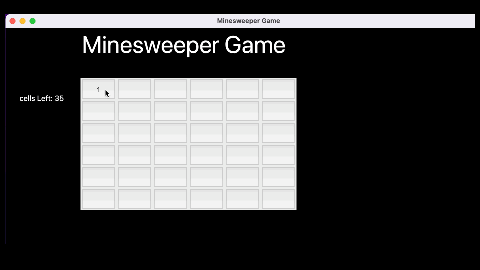

This is a simple Minesweeper Game. Rule is similar is general Minesweeper game

`Python3 Main.py` -- to run the game
Actions:
    1. To win the game open all cell without opening a Mine
    2. `Left Click` to show what is the number in cell
    3. `Right Click` to mark cell if you think it may have mine 
    4. If you click on any cell containing Mine. Game will be terminated

